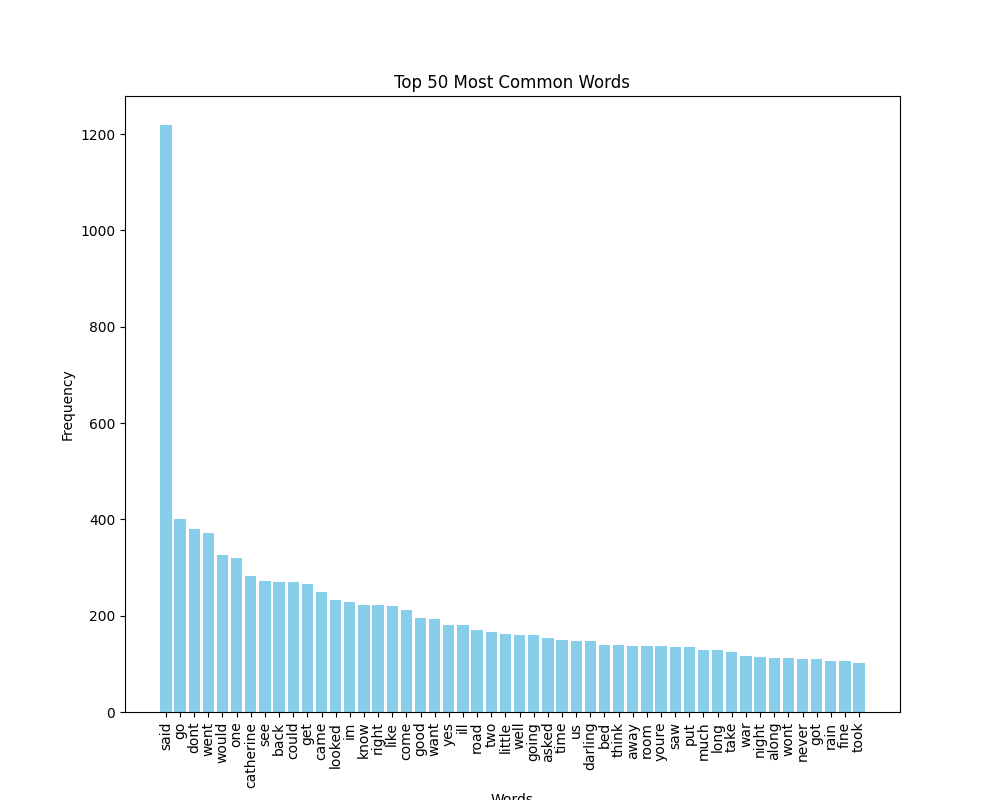
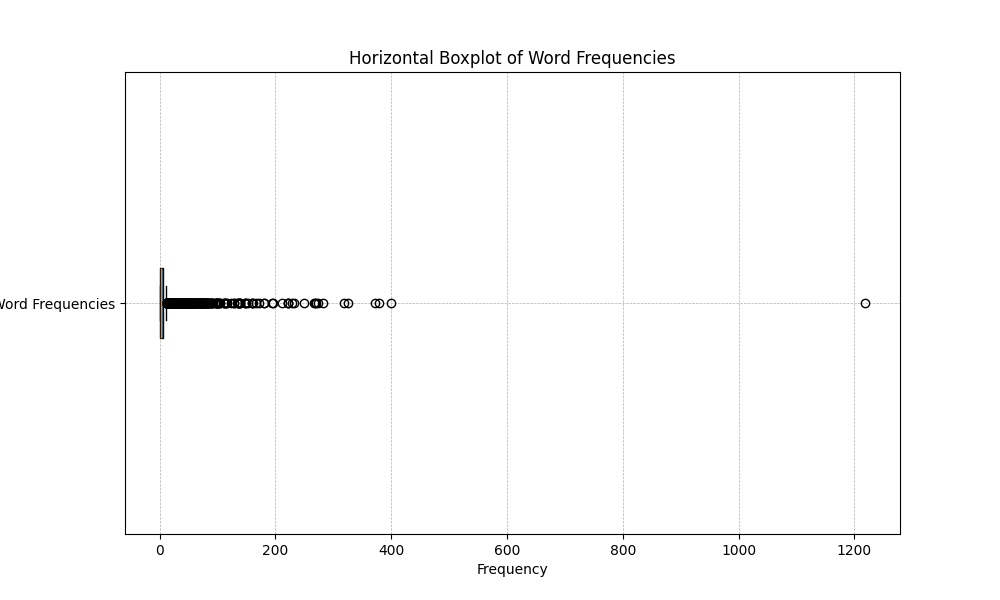
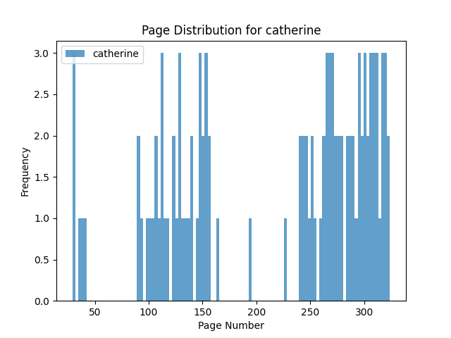

# Farewell to Arms Concordance
### Andrew S Thompson

This project was assembled in Jupyter (the notebook file "concordance.ipybn"). 

As a request from an english professor to create a word count concordance for Farewell to Arms, I was asked to produce a program that would take the text from Farewell to Arms and create a word count concordance. The end goal was a concordance that, upon elimination of stop words and unnecessary text, would create a table or dataframe formatted output containing the number of words observed, the count of each word, the pages that each word occurred on, the contexts for each word, and the chapters that each word occurred in. 

An optical character recognition model (OCR) was used to extract the text from the book because of package incompatibilities with .docx files (and prior experience with an OCR). This extracted text was analyzed for the desired outcome. The program is slightly inefficient because the for loops have not been optimized, and certain issues that are handled with nested loops could be solved differently. 

#### Figure 1

In Figure 1, it is clear that because the word "said" doesn't hold much significance to the story, it can also be excluded in the list of stop words, but it was not included. Other high frequency words are available as well, and this can give an insight into thematic and plot details. 

#### Figure 2

Figure 2 displays the density of certain word frequencies, while the outlier, the word "said" is an outlier. This is another way of determining outliers, and with different data would also be able to show low outliers, instead of just limiting to the high frequencies, or low frequencies, as the bar graph was limited. 

#### Figure 3

Figure 3 is significant for single word analysis. In this case, it is clear where Catherine is a significant detail, and where she is not significantly included. Because of this, it becomes evident using graphs like this, where words are significant. This figure displays the spots where Catherine is mentioned often, but also a part of the book where she was not mentioned at all. It is helpful to consider details like this. 
